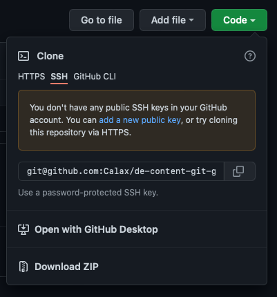

## Содержание
1. Основные понятия
2. [Основные операции](#definitions):
    2.1. Как клонировать репозиторий.
    2.2. Как создать branch
    2.3. Как создать commit
    2.4. Как создать pr
    2.5. Как добавить коммиты в pr
    2.6. Как разрешать конфликты
    2.7. 
3. Воркфлоу работы с контентом.
    3.1. Основной флоу.
    3.2. Флоу багфикса.
    3.3. Мне только букву поменять.
4. Библиотека работы с markdown.
5. FAQ
    5.1. Как посмотреть историю изменений файла?
    5.2. Я сделал(а) что-то не то. Как откатить состояние ветки?
    5.3. Какими инструментами моджно пользоваться?
    5.4. Как заливать картинки?
    5.5. А можно с картинками?
    5.6. А можно с видео?

<a name="definitions"/>
## 1. Основные понятия.
repository
branch(+main)
commit
pr

## 2. Основные операции.

### 2.1. Как клонировать репозиторий.
Вариант 1. Клонировать через консоль.
```bash
cd {path_to_destination_directory}
git clone git@github.com:Calax/de-content-git-guide.git
```

Вариант 2. Открыть в Github Desktop.




